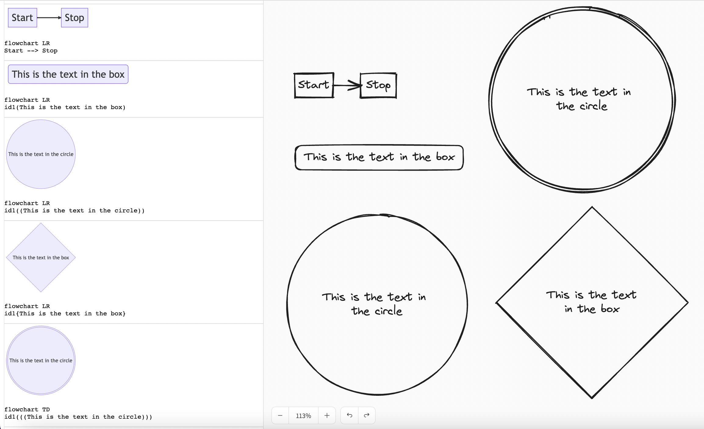
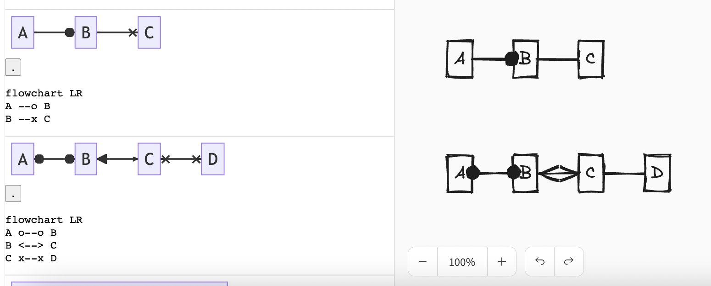
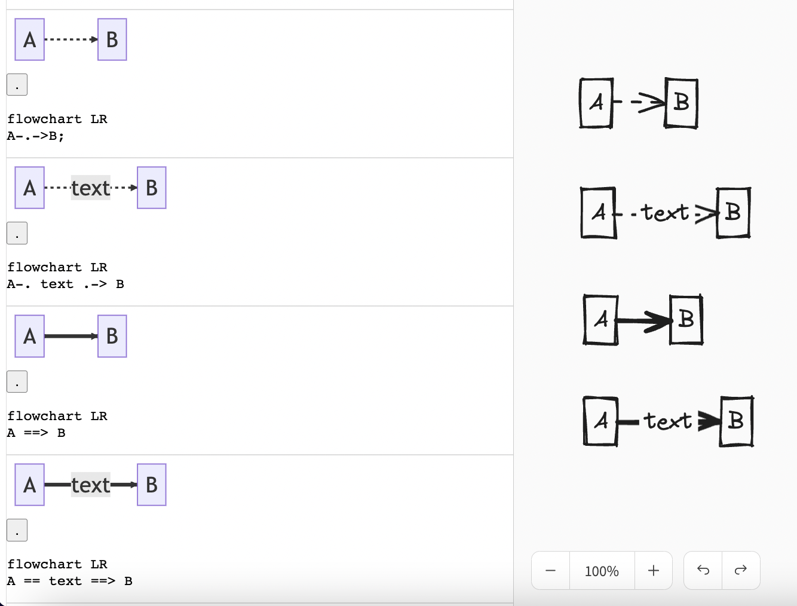
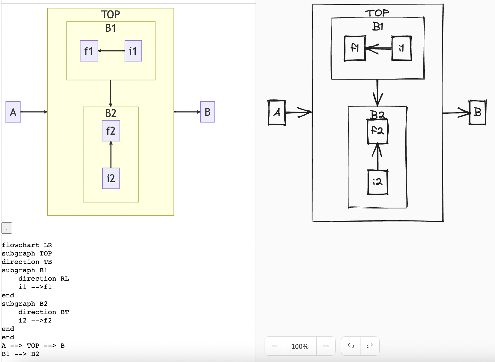
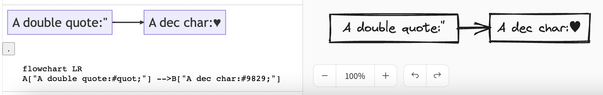
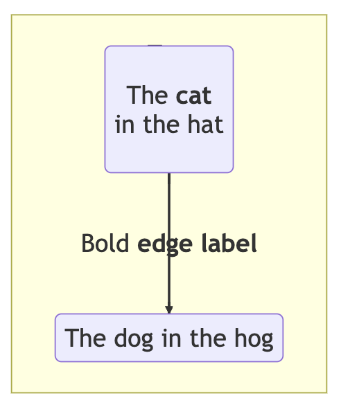
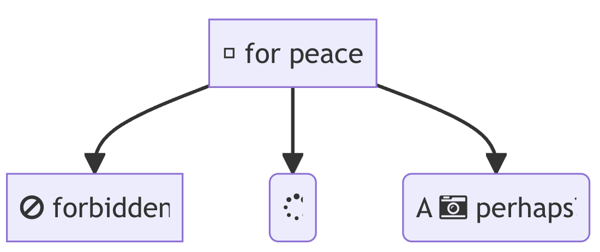
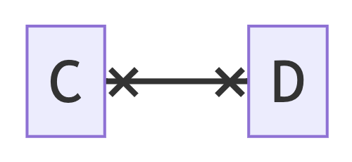
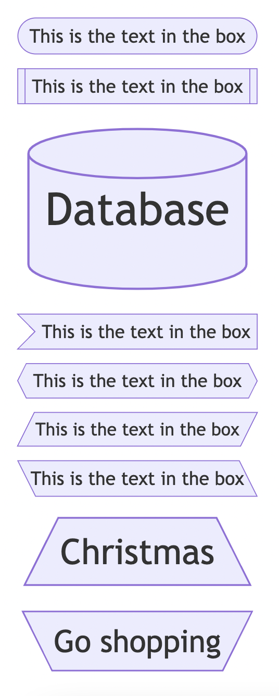

# mermaid-to-excalidraw

Convert mermaid diagrams to excalidraw

## Setup

Install packages:

```
yarn
```

Start development playground:

```
yarn start:playground
```

Eslint code test:

```
yarn test:code
```

## Documentation

```ts
// Un-supported diagram will render as SVG image (GraphImage)
function parseMermaid(
  mermaid: Mermaid,
  diagramDefinition: string,
  options?: {
    fontSize: number;
  }
): Graph | GraphImage;

interface GraphToExcalidrawResult {
  elements: ExcalidrawElement[];
  files?: BinaryFiles;
}
function graphToExcalidraw(
  graph: Graph | GraphImage,
  options?: {
    fontSize: number;
  }
): GraphToExcalidrawResult;
```

- Default font size is `20`

### Playground

- Additional Notes
  - If you're clicking the "Render to Excalidraw" button on the same diagram multiple times, you may notice a slight change of elements stroke on the Excalidraw diagram. This occurs as a result of the randomness featured in the libraries used by Excalidraw, specifically Rough.js.

### Supported features

- Flowcharts Diagram
  - Shape: rectangle, rounded corner, circle, double circle, diamond.
    
  - Arrow: arrow_circle, arrow_cross, double_arrow_circle, double_arrow_point.
    
  - Arrow stroke: dotted, thick.
    
  - Cluster
    
  - Entity codes supported.
    
  - Attached link
- Playground
  - Render all flow diagram test cases, Render to Excalidraw canvas, `parseMermaid` data, Excalidraw initial data (see: Devtool Console)
  - Custom Test Input, Custom font size, Error handling.

### Un-supported features

- Unsupported Flowchart Features
  - Markdown strings (Fallback to text)
    
  - Basic FontAwesome (Fallback to text, ignore icons)
    
  - Cross arrow (Fallback to Excalidraw's `bar` arrow type)
  - Arrow: double_arrow_cross (fallback to Excalidraw's `bar` arrow type)
    
  - Shape: subroutine, cylindrical, asymmetric, hexagon, Parallelogram, Trapezoid (all these shapes will fall back to similar supported shapes, including rectangles, rounds, rhombus.)
    
  - Custom element style e.g. font family, font color, bg color, stroke color, etc. (fallback to default styling)
- Unsupported diagram will be rendered as SVG image, For example:
  ```
  gantt
    title A Gantt Diagram
    dateFormat  YYYY-MM-DD
    section Section
    A task           :a1, 2014-01-01, 30d
    Another task     :after a1  , 20d
    section Another
    Task in sec      :2014-01-12  , 12d
    another task      : 24d
  ```
  ```
  erDiagram
    CUSTOMER ||--o{ ORDER : places
    ORDER ||--|{ LINE-ITEM : contains
    CUSTOMER }|..|{ DELIVERY-ADDRESS : uses
  ```
