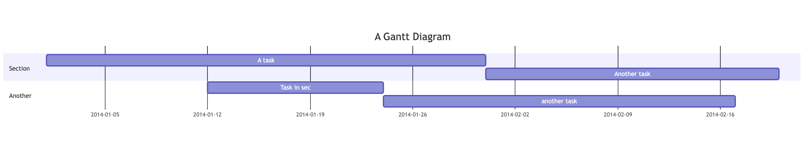
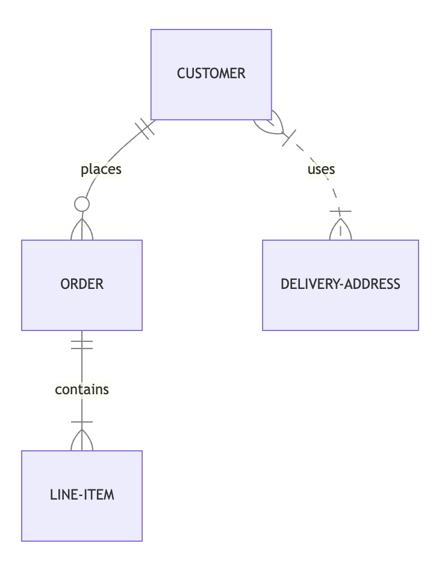

# mermaid-to-excalidraw

Convert mermaid diagrams to excalidraw

## Setup

Install packages:

```
yarn
```

Start development playground:

```
yarn start:playground
```

Eslint code test:

```
yarn test:code
```

## Get started

Example code:

```ts
import {
  parseMermaid,
  graphToExcalidraw,
} from "@excalidraw/mermaid-to-excalidraw";

let mermaidGraphData;
try {
  mermaidGraphData = await parseMermaid(diagramDefinition, {
    fontSize: DEFAULT_FONT_SIZE,
  });
} catch (e) {
  // Parse error, displaying error message to users
}

const { elements, files } = graphToExcalidraw(mermaidGraphData);

// Render elements and files on Excalidraw
```

## API

### parseMermaid

Takes `diagramDefinition` and optional `options` as inputs, and return either a `Graph` or `GraphImage`. If the diagram is unsupported, it renders as an SVG image (GraphImage).

**_Signature_**

```ts
function parseMermaid(
  diagramDefinition: string,
  options?: {
    fontSize: number; // default 20
  }
): Graph | GraphImage;
```

**How to use**

```ts
import { parseMermaid } from "@excalidraw/mermaid-to-excalidraw";
```

### graphToExcalidraw

Takes a `Graph` or `GraphImage` and optional `options` as inputs, and returns `elements` and optionally `files`.

**_Signature_**

```ts
function graphToExcalidraw(
  graph: Graph | GraphImage,
  options?: {
    fontSize: number;
  }
): {
  elements: ExcalidrawElement[];
  files?: BinaryFiles;
};
```

**How to use**

```ts
import { graphToExcalidraw } from "@excalidraw/mermaid-to-excalidraw";
```

## Playground

[Open Playground](https://mermaid-to-excalidraw.vercel.app)

- Additional Notes
  - If you're clicking the "Render to Excalidraw" button on the same diagram multiple times, you may notice a slight change of elements stroke on the Excalidraw diagram. This occurs as a result of the randomness featured in the libraries used by Excalidraw, specifically Rough.js.

## Features

### Supported features

- Flowcharts Diagram
  - Shape: rectangle, rounded corner, circle, double circle, diamond.
    
  - Arrow: arrow_circle, arrow_cross, double_arrow_circle, double_arrow_point.
    
  - Arrow stroke: dotted, thick.
    
  - Cluster
    
  - Entity codes supported.
    
  - Attached link
- Playground
  - Render all flow diagram test cases, Render to Excalidraw canvas, `parseMermaid` data, Excalidraw initial data (see: Devtool Console)
  - Custom Test Input, Custom font size, Error handling.

### Un-supported features

- Unsupported Flowchart Features

  - Markdown strings (Fallback to text)
    <table>
    <tr>
    <th align="left">
    <pre>
    flowchart LR
      subgraph "One"
      a("`The **cat** in the hat`") -- "edge label" --> b{{"`The **dog** in the hog`"}}
    end
    </pre>
    </th>
    <th>
    
    </th>
    </tr>
    </table>
  - Basic FontAwesome (Fallback to text, ignore icons)
    <table>
    <tr>
    <th align="left">
    <pre>
    flowchart TD
    B["fab:fa-twitter for peace"]
    B-->C[fa:fa-ban forbidden]
    B-->D(fa:fa-spinner)
    B-->E(A fa:fa-camera-retro perhaps?)
    </pre>
    </th>
    <th>
    
    </th>
    </tr>
    </table>
  - Cross arrow (Fallback to Excalidraw's `bar` arrow type)
  - Arrow: double_arrow_cross (fallback to Excalidraw's `bar` arrow type)
    <table>
    <tr>
    <th align="left">
    <pre>
    flowchart LR
    C x--x D
    </pre>
    </th>
    <th>
    
    </th>
    </tr>
    </table>
  - Shape: subroutine, cylindrical, asymmetric, hexagon, Parallelogram, Trapezoid (all these shapes will fall back to similar supported shapes, including rectangles, rounds, rhombus.)
    <table>
    <tr>
    <th align="left">
    <pre>
    flowchart LR
    id1([This is the text in the box])

    flowchart LR
    id1[[This is the text in the box]]

    flowchart LR
    id1[(Database)]

    flowchart LR
    id1>This is the text in the box]

    flowchart LR
    id1{{This is the text in the box}}

    flowchart TD
    id1[/This is the text in the box/]

    flowchart TD
    id1[\This is the text in the box\]

    flowchart TD
    A[/Christmas\]

    flowchart TD
    B[\Go shopping/]
    </pre>
    </th>
    <th>
    
    </th>
    </tr>
    </table>

- Unsupported diagram will be rendered as SVG image, For example:
<table>
  <tr>
    <th align="left">
      <pre>
gantt
  title A Gantt Diagram
  dateFormat  YYYY-MM-DD
  section Section
  A task           :a1, 2014-01-01, 30d
  Another task     :after a1  , 20d
  section Another
  Task in sec      :2014-01-12  , 12d
  another task      : 24d
      </pre>
    </th>
    <th>
       
    </th>
  </tr>
  <tr>
    <th align="left">
      <pre>
erDiagram
  CUSTOMER ||--o{ ORDER : places
  ORDER ||--|{ LINE-ITEM : contains
  CUSTOMER }|..|{ DELIVERY-ADDRESS : uses
      </pre>
    </th>
    <th>
       
    </th>
  </tr>
</table>
